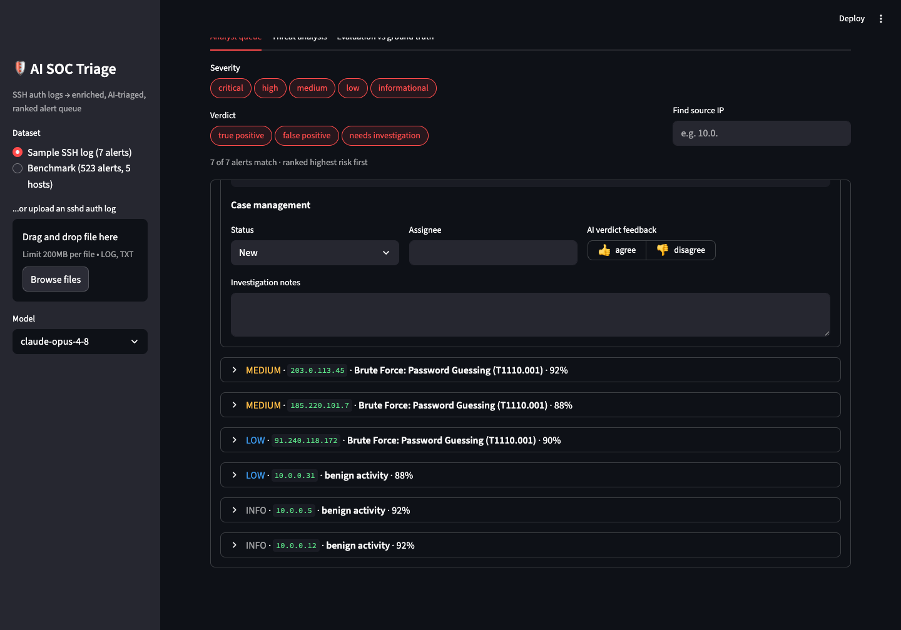
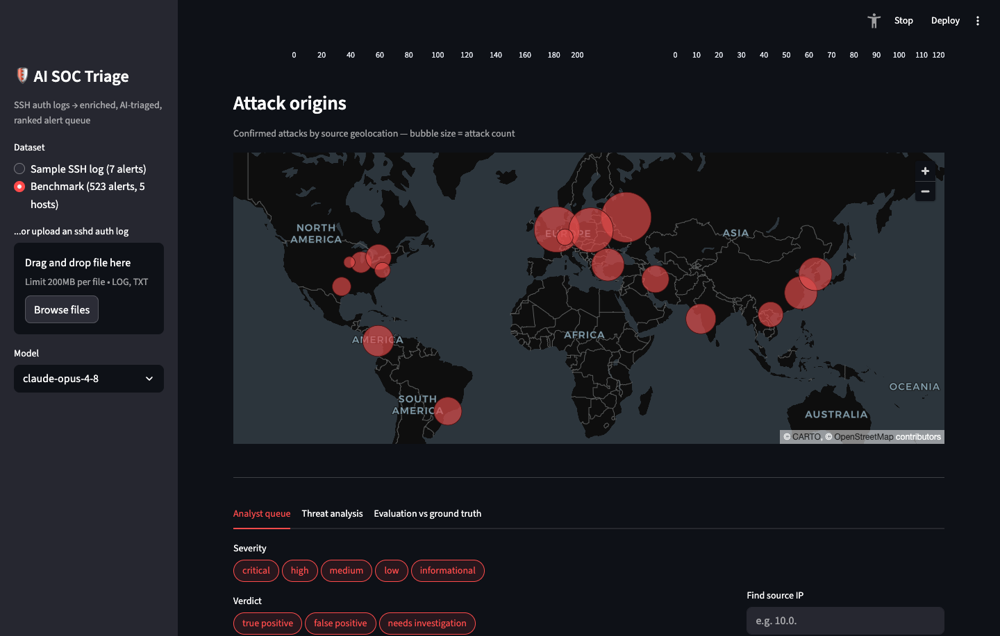
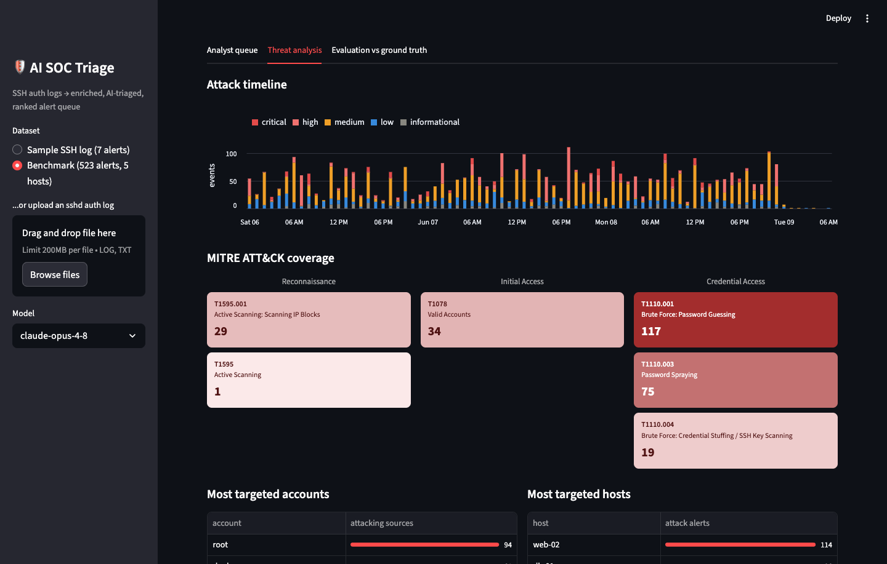
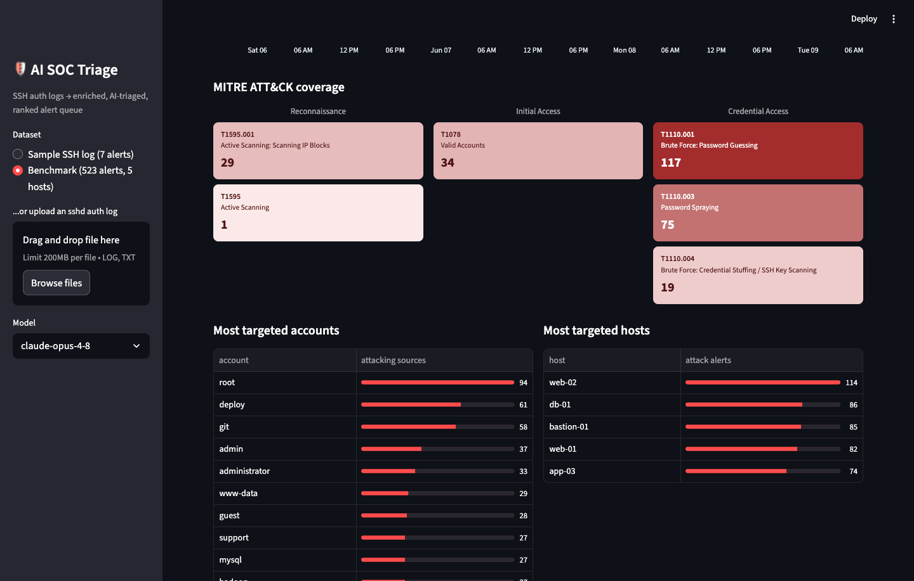
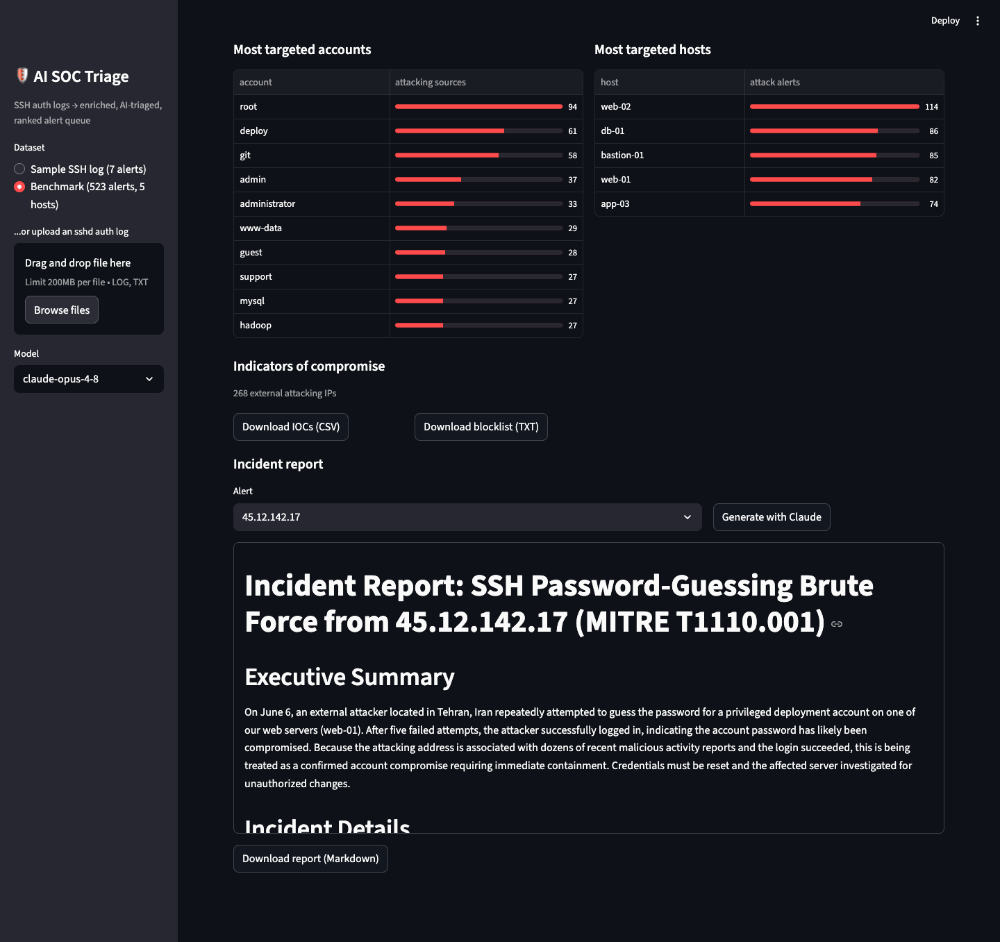

# 🛡️ AI SOC Triage

**An AI-powered Security Operations Center console: raw authentication logs
in — a ranked, explained, actionable alert queue out.**

Security teams drown in alerts. A single internet-facing server generates
thousands of authentication events a day, and somewhere in that noise are
the events that matter: the brute force that *succeeded*, the stolen
credential that logged in cleanly, the internal host quietly spraying
passwords across the estate. This project uses **Claude** to triage that
firehose the way a senior SOC analyst would — and, critically, **measures
how well it does it** against a labeled benchmark and a rule-based baseline.


## What it does

```
raw auth logs ──> parse & correlate ──> enrich ──> AI triage ──> SOC console
(sshd files,      (events grouped      (GeoIP,    (verdict,      (ranked queue,
 Splunk/AD)        per source IP)       threat     severity,      case mgmt,
                                        intel)     ATT&CK,        analytics,
                                                   actions)       IR reports)
```

1. **Parse** — sshd syslog (and Windows/AD events via Splunk) into
   structured events: failed/successful logins, pre-auth disconnects,
   max-auth-exceeded bursts, key-scanning, and pure connection probes —
   correlated into one alert per source IP.
2. **Enrich** — geolocation and threat-intel reputation per source
   (offline tables for the demo, designed to swap in AbuseIPDB/MaxMind).
3. **Triage** — Claude returns a **schema-validated structured verdict**
   per alert (Pydantic + the Anthropic structured-outputs API): verdict,
   severity, confidence, MITRE ATT&CK technique, a plain-English analyst
   summary, and prioritized response actions. A rule-based heuristic engine
   provides the offline fallback and the evaluation baseline.
4. **Work the queue** — a Streamlit console with case management,
   threat analytics, and AI-written incident reports.

## The console

### Analyst queue with case management

Every alert is a one-line row — severity, source, ATT&CK technique,
confidence — that expands into the full investigation: Claude's analyst
summary, prioritized actions, enrichment, and the raw log evidence.
Alerts have a **lifecycle** (New → Investigating → Contained → Closed) with
assignee and notes, persisted across sessions — and an **agree/disagree
control on every AI verdict**, exportable as new labeled training data.



### Attack origins

Confirmed attacks aggregated by source geolocation — bubble size scales
with attack count.



### Threat analysis

An hourly **attack timeline** (colored by severity — campaigns stand out
against background noise), a **MITRE ATT&CK coverage matrix** in Navigator
style, **most-targeted accounts and hosts**, and one-click **IOC export**
(CSV with reputation/tags/ATT&CK, or a plain-text blocklist).




### AI incident reports

Pick any confirmed attack and Claude writes a formal incident report —
executive summary, evidence with quoted log lines, impact assessment,
prioritized remediation, IOCs — ready to download as markdown.



### Evaluation, built in

Triage verdicts are graded against hand-labeled ground truth right in the
console ([screenshot](docs/dashboard_eval.png)) — because an AI security
tool you haven't measured is a liability, not an asset.

## Benchmark: 523 alerts, deliberately hard

`generate_dataset.py` builds a fresh randomized benchmark every run
(IPs, hosts, usernames, volumes, timing — seed printed for
reproducibility) with the noise real sshd logs contain. The hard cases are
designed to break naive rules: slow-and-low brute force, distributed botnet
sprays (2 attempts per IP), **stolen-credential logins with zero
failures**, employees logging in from home IPs that *look* like
compromises, and misconfigured cron jobs that look like internal attacks.

```bash
python generate_dataset.py            # new random ~500-alert dataset
python generate_dataset.py --seed 42  # reproduce the committed benchmark
python main.py data/large_auth.log --llm --json results.json
python evaluate.py results.json data/large_labels.csv
```

Committed benchmark (`--seed 42`): 3,912 log lines → 523 alerts
(263 attacks, 260 benign, 173 hard cases) across 5 hosts:

| Engine | Dataset | Precision | Recall | False alarms | Dangerous misses |
|---|---|---|---|---|---|
| Heuristic baseline | 523 alerts | 80% | 61% | 40 | 0 |
| Claude Sonnet (`claude-sonnet-4-6`) | 523 alerts | 94% | **98%** | 17 | 0 |
| Claude Opus (`claude-opus-4-8`) | 52-alert subset* | **100%** | 85% | **0** | 0 |

Scoring is SOC-shaped: punting an attack to "needs investigation" costs
recall, and explicitly clearing a real attack counts as a **dangerous
miss** (neither engine had any).

**The two Claude tiers fail in opposite directions**, and the benchmark
makes that tradeoff measurable. Sonnet is recall-oriented: it caught 257 of
263 attacks — including every stolen-credential login (T1078), a pattern
failure-counting rules are structurally blind to — but it is noisy, punting
97 benign alerts to human review. Opus is precision-oriented: zero false
alarms and confident benign clears (it correctly cleared every
employee-at-home "compromise lookalike" the rule engine paged on), at the
cost of more conservative recall. A one-analyst team drowns in Sonnet's
punts; a staffed SOC might happily pay that noise for the recall. **Model
choice is an operational decision, not a leaderboard decision.**

*Opus measured on the 52-alert (`--scale 1`) version; the heuristic was
stable across scales (80/62 → 80/61). A full 523-alert Opus run costs ~$10.

## Quick start

```bash
git clone https://github.com/nahinhayat/ai-soc-triage && cd ai-soc-triage
pip install -r requirements.txt

# Dashboard — the committed benchmark results load with NO API key needed
streamlit run dashboard.py

# CLI, heuristic engine (no key needed)
python main.py

# CLI, Claude engine
export ANTHROPIC_API_KEY=sk-ant-...
python main.py --llm --json results.json
python evaluate.py results.json
```

## Splunk + Active Directory integration

The pipeline can pull live **Windows/AD authentication events** (4625
failed / 4624 successful logons) from Splunk via the REST API instead of
flat files:

```bash
export SPLUNK_HOST=mystack.splunkcloud.com
export SPLUNK_TOKEN=eyJr...                  # Settings > Tokens in Splunk Web
export SPLUNK_INDEX=wineventlog
python main.py --source splunk --earliest -24h@h --llm
```

Splunk events normalize into the same internal event model, so enrichment,
triage, and reporting are identical. AD semantics are handled in triage:
internal sources are **not** assumed benign — failures from one internal
host across many accounts flag as lateral movement / internal spraying
(T1110.003). The wire-format mapping is covered by an offline fixture
(`data/sample_splunk_export.jsonl`), testable without a live instance.

## AI engineering notes

- **Structured outputs, not free text** — verdicts come back as a
  validated Pydantic model via `client.messages.parse()`; malformed
  responses fail loudly instead of corrupting the queue
- **Prompt caching** — the analyst system prompt is cached
  (`cache_control: ephemeral`), so N alerts pay for the instructions once
- **Parallel triage** with a bounded worker pool and a rate-limit-aware
  retry budget (the SDK honors `retry-after`; large batches on lower API
  tiers wait out per-minute token limits instead of aborting)
- **The LLM never decides alone** — threat intel is context to weigh, the
  heuristic baseline exists so LLM verdicts are benchmarked, and the
  dashboard's feedback loop turns analyst corrections into labeled data

## Project structure

```
├── main.py                  # CLI: parse → enrich → triage → ranked report
├── dashboard.py             # Streamlit SOC console
├── evaluate.py              # precision/recall vs labeled ground truth
├── generate_dataset.py      # randomized benchmark generator (--seed, --scale)
├── src/
│   ├── parser.py            # sshd log parser + per-source alert correlation
│   ├── enrich.py            # GeoIP + threat-intel enrichment
│   ├── triage.py            # Claude triage, heuristic baseline, IR reports
│   ├── splunk_source.py     # Windows/AD events via the Splunk REST API
│   └── case_store.py        # persisted case state (status, notes, feedback)
├── data/                    # sample logs, benchmark, labels, precomputed results
├── docs/                    # screenshots
└── scripts/                 # screenshot automation
```

## Roadmap

- [ ] Live enrichment: AbuseIPDB + MaxMind GeoLite2
- [ ] Agentic enrichment: Claude calls the lookup tools itself via tool use
- [x] Splunk ingestion (`--source splunk`, Windows/AD events 4624/4625)
- [x] Windows Event Log support — covered by the Splunk integration
- [x] Streamlit SOC console with case management and analytics
- [x] Reproducible 500-alert benchmark with hard cases

## Disclaimer

All log data is synthetic, generated for demonstration. IP addresses are
from documentation/example ranges or generated at random; no real systems
were involved. Built as a portfolio project exploring AI-assisted security
operations.
