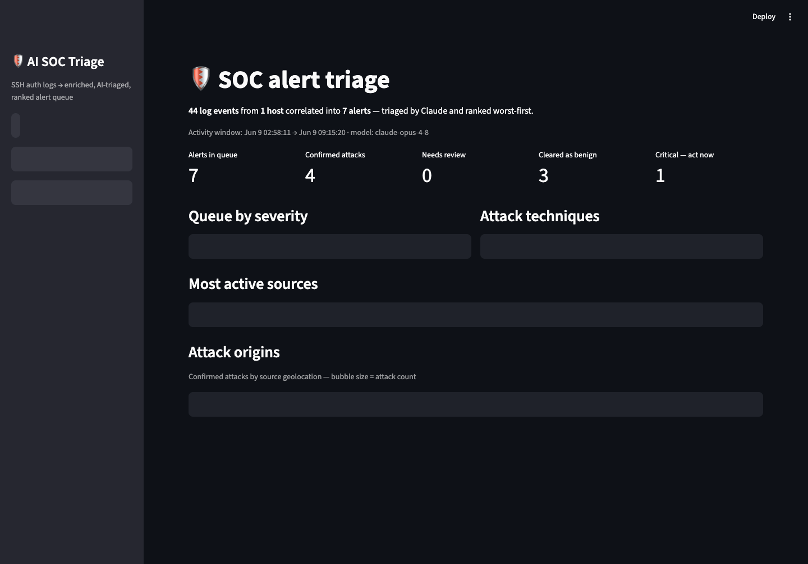
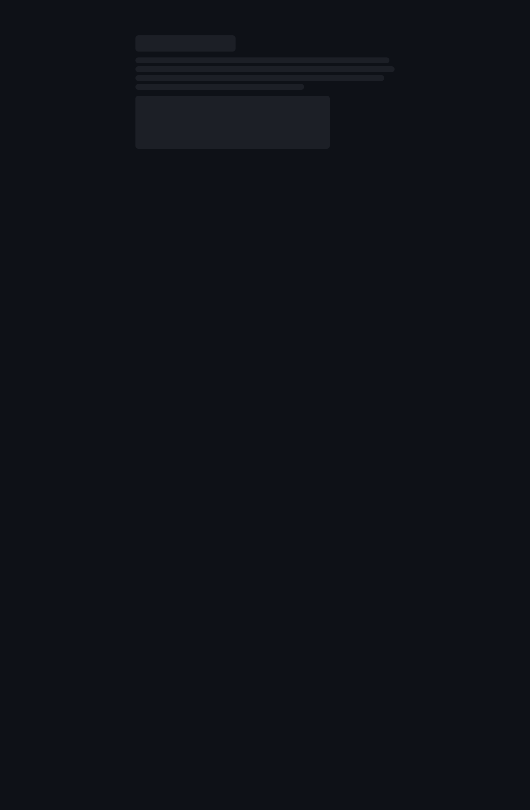

# AI SOC Triage — LLM-Assisted SSH Alert Triage Pipeline

An AI-powered Security Operations Center (SOC) assistant that ingests raw SSH
authentication logs, enriches them with threat intelligence context, and uses
**Claude** to triage each alert the way a Tier 2 analyst would — producing a
ranked queue with verdicts, MITRE ATT&CK mappings, plain-English summaries,
and prioritized response actions.

Built to address the #1 pain point in security operations: **alert fatigue**.
Analysts drown in raw events; this pipeline turns them into a short, ranked
list of what actually matters.



*The Streamlit dashboard: correlated alerts ranked worst-first, with Claude's
analyst summary, prioritized response actions, threat-intel enrichment, and
the raw log evidence per alert ([full-page screenshot](docs/dashboard.png)).*

### SOC console features

Beyond triage, the dashboard covers the alert lifecycle the way a real SOC
console does:

- **Case management** — per-alert status (New → Investigating → Contained →
  Closed), assignee, and investigation notes, persisted across sessions;
  status shows in the queue row
- **Analyst feedback loop** — agree/disagree on every AI verdict, exportable
  as CSV: analyst corrections become new labeled training data
- **Attack timeline** — hourly event volume colored by severity, for
  spotting campaigns vs background noise
- **MITRE ATT&CK coverage matrix** — observed tactics × techniques with
  alert counts
- **Entity analytics** — most-targeted accounts and hosts across all
  confirmed attacks
- **IOC export** — one-click CSV of attacking IPs (with reputation, tags,
  ATT&CK) or a plain-text firewall blocklist
- **AI incident reports** — pick any confirmed attack and Claude writes a
  formal markdown incident report (executive summary, evidence, impact,
  remediation, IOCs) ready to download

## Pipeline

```
raw auth.log ──> parse & correlate ──> enrich ──> triage ──> ranked report
                 (group events per     (GeoIP,    (Claude or  (severity-sorted
                  source IP)           threat     heuristic    queue + actions)
                                       intel)     baseline)
```

1. **Parse** — regex-based parser turns `sshd` syslog lines into structured
   events, correlated into one alert per source IP (failed/successful logins,
   usernames targeted, success-after-failure detection).
2. **Enrich** — each alert gets geolocation and threat-intel reputation
   context (offline static table for the demo; designed to swap in AbuseIPDB /
   VirusTotal / MaxMind with no other changes).
3. **Triage** — Claude receives the enriched alert and returns a **schema-validated
   structured verdict** (Pydantic + the Anthropic structured-outputs API):
   verdict, severity, confidence, MITRE ATT&CK technique, analyst summary,
   and ordered response actions. A rule-based heuristic engine serves as an
   offline fallback and evaluation baseline.
4. **Report** — results are ranked by severity and confidence into an analyst
   queue rendered in the terminal.

## Quick start

```bash
pip install -r requirements.txt

# No API key needed — heuristic baseline on the bundled sample log
python main.py

# Claude-powered triage
export ANTHROPIC_API_KEY=sk-ant-...
python main.py --llm

# Interactive dashboard (upload your own logs, switch engines, view evals)
streamlit run dashboard.py
```

## Splunk + Active Directory integration

Instead of flat files, the pipeline can pull live **Windows / Active Directory
authentication events** (EventCode 4625 failed logon, 4624 successful logon)
from a Splunk instance via the REST API:

```bash
export SPLUNK_HOST=mystack.splunkcloud.com   # or your server IP
export SPLUNK_TOKEN=eyJr...                  # Settings > Tokens in Splunk Web
export SPLUNK_INDEX=wineventlog

python main.py --source splunk --earliest -24h@h --llm
```

Splunk events are normalized into the same internal event model as SSH logs,
so enrichment, triage, and reporting are identical. AD-specific semantics are
handled in triage: internal sources are not assumed benign — many failures
from one internal host across multiple accounts is flagged as possible
lateral movement / internal password spraying (T1110.003).

See `.env.example` for all connection options (basic auth, self-signed
certs, custom index). The Splunk-to-pipeline mapping is covered by an offline
fixture (`data/sample_splunk_export.jsonl`) so it can be tested without a
live instance.

## Evaluation

The repo includes hand-labeled ground truth (`data/labels.csv`) for every
source IP in the sample log, and an evaluation harness that measures triage
precision and recall — because an AI security tool you haven't measured is a
liability, not an asset.

```bash
python main.py --llm --json results.json
python evaluate.py results.json
```

### Benchmark: randomized multi-host dataset with realistic sshd noise

`generate_dataset.py` builds a fresh benchmark every run — randomized IPs,
hosts, usernames, volumes, timing, and scenario counts (the seed is printed,
so any run is reproducible with `--seed`). Beyond failed/accepted passwords
it emits the noise real sshd logs contain: pre-auth disconnects,
`maximum authentication attempts exceeded` bursts, failed publickey attempts
(key scanning), and pure connection probes from scanners that never attempt
authentication.

Hard cases are designed to break naive rules: slow-and-low brute force,
distributed botnet sprays (2 attempts per IP), stolen-credential logins with
*zero* failures, employees logging in from home IPs that *look* like
compromises, and misconfigured cron jobs that look like internal attacks.

```bash
python generate_dataset.py            # new random ~500-alert dataset each run
python generate_dataset.py --seed 42  # reproduce the committed benchmark
python generate_dataset.py --scale 1  # smaller ~50-alert dataset
python main.py data/large_auth.log --llm --json results.json
python evaluate.py results.json data/large_labels.csv
```



*The full benchmark in the dashboard: 523 alerts triaged by Claude Sonnet,
50 criticals surfaced — including stolen-credential logins (T1078) that
volume-based rules can't see. The committed results
(`data/benchmark_results_sonnet.json`) load instantly in the dashboard, no
API key needed.*

Committed benchmark (`--seed 42`): 3,912 log lines → 523 alerts
(263 attacks, 260 benign, 173 hard cases) across 5 hosts:

| Engine | Dataset | Precision | Recall | False alarms | Dangerous misses |
|---|---|---|---|---|---|
| Heuristic baseline | 523 alerts | 80% | 61% | 40 | 0 |
| Claude Sonnet (`claude-sonnet-4-6`) | 523 alerts | 94% | **98%** | 17 | 0 |
| Claude Opus (`claude-opus-4-8`) | 52-alert subset* | **100%** | 85% | **0** | 0 |

**The two Claude tiers fail in opposite directions**, and the benchmark
makes that tradeoff measurable. Sonnet is recall-oriented: it caught 257 of
263 attacks and never cleared a real attack as benign — but it is noisy,
raising 17 false alarms and punting 97 benign alerts to investigation
(~114 alerts an analyst touches unnecessarily). Opus is precision-oriented:
zero false alarms and confident benign clears, at the cost of more
conservative recall. A one-analyst team drowns in Sonnet's punts; a staffed
SOC might happily pay that noise for a 13-point recall gain. Model choice
is an operational decision, not a leaderboard decision.

*Opus was measured on the earlier 52-alert (`--scale 1`) version of this
benchmark (a full 523-alert Opus run costs ~$10 in API usage). The
heuristic's scores were stable across both scales (80/62 at 52 alerts vs
80/61 at 523). The Sonnet run: 523 alerts, ~40 minutes (tier-1 API rate
limits), ~$4.

Scoring is SOC-shaped: punting an attack to "needs investigation" costs
recall, and explicitly clearing an attack counts as a dangerous miss
(neither engine had any).

Where the gap comes from — the hard cases:

- **Employee home logins** (typo then success from a residential IP): the
  heuristic raises CRITICAL false alarms on all 3; Claude cleared all 3,
  reasoning that "low-volume, single-account, no invalid users, clean
  intel" fits a typo, not an attack.
- **Stolen credentials** (clean login from infostealer infrastructure, zero
  failures): invisible to failure-counting rules; Claude flagged it
  CRITICAL and mapped it to **T1078 Valid Accounts** — the correct
  technique, not brute force.
- **Distributed spray** (botnet /24, 2 attempts per IP): under every
  per-IP threshold; Claude caught all 4 nodes from intel context.
- **Slow-and-low** (3 root failures spread over hours): under the volume
  threshold; Claude flagged all 3 using reputation + targeting pattern.

Every recall miss from Claude was a conservative punt to
needs_investigation with the correct hypothesis attached — never a cleared
attack. It also punts ambiguous benign cases (employee home logins, dead
cron jobs) rather than guessing, which is exactly the Tier 1 behavior you
want: zero dangerous misses on both sides of the queue. On the small
hand-built sample (`data/sample_auth.log` + `data/labels.csv`) both engines
score 7/7; that set is kept as a quick smoke test.

A full ~50-alert Claude run takes ~90 seconds (4 parallel workers) and
costs roughly $1 in API usage.

## What the sample log contains

The bundled `data/sample_auth.log` simulates one day on an internet-facing
web server, including:

| Pattern | Source | Ground truth |
|---|---|---|
| Multi-username brute force (15 attempts) | `203.0.113.45` | attack (blocked) |
| **Success after repeated failures** | `198.51.100.23` | account compromise |
| Root brute force from a Tor exit node | `185.220.101.7` | attack (blocked) |
| Credential spraying on service accounts | `91.240.118.172` | attack (blocked) |
| Routine admin publickey logins | `10.0.0.5` | benign |
| User typo then successful login | `10.0.0.12` | benign |

## Design notes

- **Structured outputs, not free text.** Triage verdicts come back as a
  validated Pydantic model via `client.messages.parse()` — no brittle JSON
  parsing of model prose, and malformed responses fail loudly.
- **Prompt caching.** The system prompt is cached (`cache_control: ephemeral`)
  so triaging N alerts only pays for the analyst instructions once.
- **The LLM never decides alone.** Threat-intel reputation is provided as
  *context to weigh*, and the heuristic baseline exists so LLM verdicts can be
  benchmarked, not blindly trusted.

## Roadmap

- [ ] Live enrichment: AbuseIPDB + MaxMind GeoLite2
- [x] Splunk ingestion (`--source splunk` pulls Windows/AD events 4624/4625 via the REST API)
- [ ] Agentic enrichment: let Claude call lookup tools itself via tool use
- [ ] Windows Event Log (4625/4624) support
- [x] Streamlit dashboard (`streamlit run dashboard.py`)

## Disclaimer

All log data is synthetic, generated for demonstration. IP addresses are from
documentation/example ranges or well-known public scanner ranges; no real
systems were involved.
